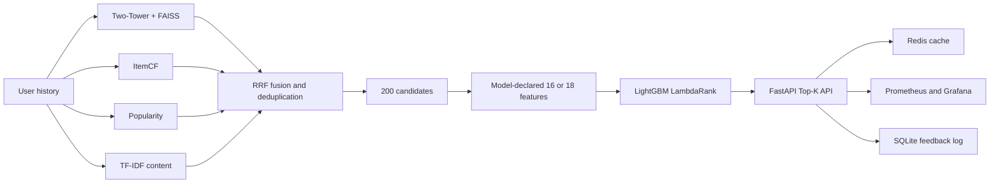

# Leakage-Aware Two-Stage Recommendation System

[中文](README.md) | English

An end-to-end recommendation research prototype built on 197,597 temporally
split Amazon Video Games interactions. It combines collaborative, neural, and
content retrieval with LambdaRank, then serves the frozen pipeline through a
versioned FastAPI/Redis/Docker stack.

The project focuses on reproducible offline evaluation, leakage-aware feature construction, cold-start retrieval, and consistency between offline ranking and online serving.

## Highlights

| Result | Evidence |
| --- | ---: |
| Evaluated users / items | 19,621 / 14,391 |
| Four-channel test Candidate Recall@200 | 24.20% |
| Matched three-channel baseline (content ablation) | 20.65% |
| Strict-cold test Recall@100 | Content 14.29%, Two-Tower 0% |
| Strict-cold test users | 721 |
| Content-aware validation NDCG@10| LambdaRank 3.85%, RRF order 3.19% |
| Offline/serving Top-10 parity | 20/20 users |
| Automated tests | 30 passed |

The fixed candidate budget remains 200. The content gain therefore comes from
better candidate composition rather than retrieving more items. The strict-cold
comparison is supported by a 95% bootstrap interval and an exact McNemar test.

## Architecture



The Content-aware serving version is `recsys_phase6_content_v1`. The original
`recsys_baseline_v1` remains an immutable rollback snapshot.

The frozen three-channel baseline uses 16 ranking features; the content-aware
ranker adds `content_score` and `content_rank` for a total of 18. The 20.65%
three-channel result is the matched baseline for the content ablation, while
the frozen baseline V1 test result is reported separately as 21.00%.

## Research Design

- Per-user temporal splits separate retrieval training, rank training,
  validation, and test interactions.
- Retrieval metrics use the complete training catalog rather than sampled
  negatives.
- TF-IDF vocabulary is fitted only on retrieval-training catalog items, while
  the searchable matrix includes metadata-visible cold items.
- A second evaluation uses pre-registered global cutoffs at 2016-01-01 and
  2017-01-01.
- A controlled three-seed ablation isolates logQ sampling correction. It
  improves accuracy consistently but reduces catalog coverage and increases
  popularity bias; both sides of the trade-off are reported.
- Offline and serving code paths are checked for exact Top-10 parity.

## Repository Guide

| Path | Purpose |
| --- | --- |
| `src/recsys/data` | Downloading, cleaning, metadata audit, temporal splits |
| `src/recsys/retrieval` | Popularity, ItemCF, Two-Tower, FAISS, TF-IDF content |
| `src/recsys/ranking` | Candidate fusion, feature generation, LambdaRank |
| `src/recsys/serving` | API, cache, feedback, metrics, version resolution |
| `configs` | Reproducible experiment and serving configuration |
| `tests` | Unit, smoke, API, and leakage checks |
| `results` | Compact machine-readable research evidence |
| `reports` | Full Chinese research report and supporting analysis |
| `monitoring` | Prometheus and Grafana configuration |
| `deploy` | Ubuntu VM deployment instructions |

## Quick Verification

Python 3.11 or newer is required.

```bash
python -m pip install --index-url https://download.pytorch.org/whl/cpu "torch>=2.2,<3"
python -m pip install -e ".[dev]"
python -m ruff check .
python -m pytest -q
```

The tests use synthetic fixtures and do not require the Amazon dataset or model
artifacts.

## Run the Frozen Demo

Large data and model binaries are deliberately excluded from Git history. A
runtime bundle can be attached to the GitHub Release for
`recsys_phase6_content_v1`. Extract that archive into the repository root, then:

```bash
docker compose -p recsys-content -f docker-compose.content.yml up -d --build
curl http://127.0.0.1:8001/health
curl "http://127.0.0.1:8001/recommend/A0266076X6KPZ6CCHGVS?k=10"
curl "http://127.0.0.1:8001/recommend/unknown-user?k=5"
```

Expected health version: `recsys_phase6_content_v1`. Unknown users use a
deterministic popularity fallback. `k` is restricted to 1 through 50.

Build the release bundle from a fully trained local workspace with:

```bash
python scripts/package_github_release.py
```

## Data

The formal experiment uses the public UCSD McAuley Lab Amazon Reviews 2018
Video Games 5-core dataset:

- [Interactions](https://mcauleylab.ucsd.edu/public_datasets/data/amazon_v2/categoryFilesSmall/Video_Games_5.json.gz)
- [Product metadata](https://mcauleylab.ucsd.edu/public_datasets/data/amazon_v2/metaFiles2/meta_Video_Games.json.gz)

Ratings of at least 3 are treated as positive implicit-feedback proxies. They
are not impressions, clicks, or purchases.

## Engineering Validation

- `recsys_phase6_content_v1` contains checksumed Two-Tower, FAISS, TF-IDF, and
  LambdaRank artifacts.
- The Content-aware Docker stack was validated on an AWS Ubuntu host at port 8001
  while the baseline remained healthy at port 8000.
- Known-user, unknown-user fallback, invalid-parameter, metrics, Redis, and
  health paths were exercised successfully.
- A local one-process load test saturated around 11-15 QPS; P95 latency rose to
  8.30 seconds at concurrency 50. This is reported as a limitation, not an SLA.

## Limitations

- Public review data has no exposure logs, online CTR/CVR, purchases, or A/B
  tests, so no commercial lift is claimed.
- Static metadata availability time cannot be independently reconstructed.
- The content channel is interpretable TF-IDF plus score-level RRF, not a jointly
  trained hybrid item tower.
- SQLite and anonymous Grafana access are appropriate for a demo, not a
  multi-tenant production platform.

See [the full Chinese research report](reports/final_research_report_zh.md) and
[the serving guide](README_SERVING.md) for implementation and evaluation detail.
